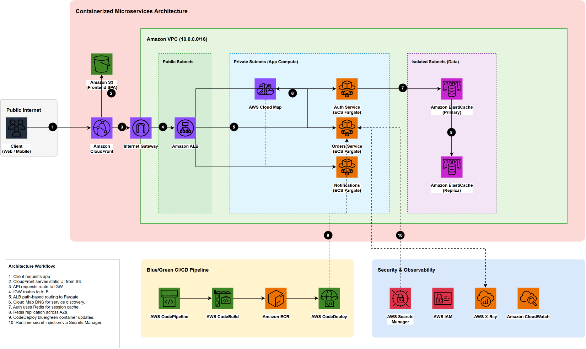
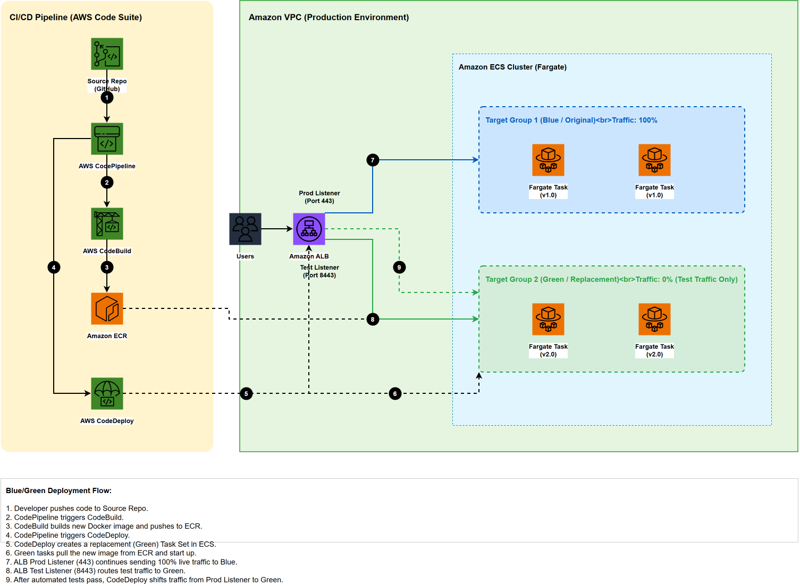

# 🚀 Containerized Microservices with ECS Fargate and Service Discovery


> [!NOTE]
> This repository demonstrates how to refactor a monolithic Node.js application into three modern, stateless microservices running entirely on Amazon ECS Fargate, with a full CI/CD pipeline, frontend hosting, and observability baked in.

---

## 📑 Table of Contents

- [Overview](#-overview)
- [Architecture Deep-Dive](#-architecture-deep-dive)
  - [The Microservices](#the-microservices)
  - [Service Communication](#service-communication)
  - [Deployment Pipeline](#deployment-pipeline)
- [Infrastructure as Code (CDK)](#️-infrastructure-as-code-cdk)
  - [CDK Constructs](#cdk-constructs)
- [Getting Started](#-getting-started)
  - [Prerequisites](#prerequisites)
  - [Installation](#installation)
  - [Local Testing](#local-testing)
  - [Deployment](#deployment)
  - [Post-Deployment: Activate the CI/CD Pipeline](#post-deployment-activate-the-cicd-pipeline)
- [Default Credentials](#-default-credentials)
- [API Reference](#-api-reference)
- [Project Structure](#-project-structure)
- [Estimated Cost](#-estimated-cost)
- [License](#-license)

---

## 🌟 Overview

This repository takes a legacy, tightly-coupled Node.js monolith and splits it into **three distinct, decoupled microservices**:

- 🔐 **Auth Service** — Manages user authentication, session creation, and token validation via Redis.
- 📦 **Orders Service** — Processes e-commerce transactions; validates sessions by calling the Auth Service over internal DNS.
- 🔔 **Notifications Service** — Dispatches order alerts; receives calls from the Orders Service over internal DNS.

Instead of managing servers, everything runs on **AWS ECS Fargate** (serverless containers). On the front end, a sleek **Angular 19** SPA is hosted on Amazon S3 and delivered globally via **Amazon CloudFront**. An **Application Load Balancer (ALB)** routes API requests to the right Fargate containers, while the microservices communicate securely using **AWS Cloud Map** for service discovery and **Amazon ElastiCache (Redis)** for session management.

---

## 🏗️ Architecture Deep-Dive

All infrastructure is automated using the **AWS Cloud Development Kit (CDK)** in TypeScript. Traffic flows from users through CloudFront, hits the ALB (for API calls), and is load-balanced across Fargate tasks running safely in private subnets.

### The Microservices

*Note: You can view and edit the source diagram by opening [`architecture_diagram.drawio`](./architecture_diagram.drawio) in [Draw.io](https://app.diagrams.net/).*

> [!TIP]
> The microservices do **not** use public IP addresses. They communicate entirely over internal DNS provided by AWS Cloud Map (e.g. `http://auth.microservices.local:3000`), keeping your internal traffic secure and isolated.

### Service Communication

| Caller | Callee | Purpose |
| :--- | :--- | :--- |
| Frontend (Angular) | Auth Service via CloudFront → ALB | Login and session management |
| Frontend (Angular) | Orders Service via CloudFront → ALB | Place and list orders |
| Orders Service | Auth Service (`http://auth.microservices.local:3000`) | Validate session token before processing order |
| Orders Service | Notifications Service (`http://notifications.microservices.local:3000`) | Trigger order-confirmation notification |

### Deployment Pipeline

Each commit to the `main` branch on GitHub triggers **AWS CodePipeline** which:
1. **Source** — Pulls the latest code from GitHub via AWS CodeStar Connection.
2. **Build** (parallel) — Runs four CodeBuild projects simultaneously:
   - Builds & pushes the `auth` Docker image to ECR.
   - Builds & pushes the `orders` Docker image to ECR.
   - Builds & pushes the `notifications` Docker image to ECR.
   - Builds the Angular frontend, syncs it to S3, and invalidates the CloudFront cache.
3. **Deploy** — Rolls out the new Docker images to ECS Fargate services with zero-downtime rolling deployments.


*Note: You can view and edit the source diagram by opening [`blue_green_deployment_diagram.drawio`](./blue_green_deployment_diagram.drawio) in [Draw.io](https://app.diagrams.net/).*

---

## 🛠️ Infrastructure as Code (CDK)

### CDK Constructs

The CDK stack (`source/`) is organized into focused, reusable constructs:

| Construct | File | Responsibility |
| :--- | :--- | :--- |
| `NetworkConstruct` | `network-construct.ts` | VPC, public/private subnets, NAT Gateways, security groups |
| `EcrConstruct` | `ecr-construct.ts` | ECR repositories for `auth`, `orders`, `notifications` images |
| `SecretsConstruct` | `secrets-construct.ts` | AWS Secrets Manager secrets for DB credentials and JWT keys |
| `RedisConstruct` | `redis-construct.ts` | ElastiCache Redis cluster (`cache.t3.micro`) for session storage |
| `ServiceDiscoveryConstruct` | `service-discovery-construct.ts` | AWS Cloud Map private DNS namespace (`microservices.local`) |
| `AlbConstruct` | `alb-construct.ts` | Internet-facing ALB with path-based routing to Fargate tasks |
| `EcsFargateConstruct` | `ecs-fargate-construct.ts` | ECS Cluster, Fargate task definitions, and services (with X-Ray sidecar) |
| `FrontendConstruct` | `frontend-construct.ts` | S3 bucket + CloudFront distribution + `BucketDeployment` for Angular SPA |
| `PipelineConstruct` | `pipeline-construct.ts` | CodePipeline CI/CD for backend images and frontend S3 deployment |

**Stack Outputs (printed after `cdk deploy`):**

| Output Key | Description |
| :--- | :--- |
| `CloudFrontURL` | ✅ **Main app URL** — Open this in your browser to access the Angular frontend |
| `LoadBalancerDNS` | Backend API URL (used internally by CloudFront) |
| `CloudMapNamespaceName` | Private DNS namespace used for inter-service communication (`microservices.local`) |

---

## 🚀 Getting Started

### Prerequisites

Before you start, ensure your environment has:

- [AWS CLI](https://aws.amazon.com/cli/) installed and configured (`aws configure`)
- **Node.js 20.x** or newer
- **Angular CLI** — `npm install -g @angular/cli` (if modifying the frontend)
- **Docker Desktop** (for building and testing containers locally)
- **AWS CDK Toolkit** — `npm install -g aws-cdk`

### Installation

```bash
git clone https://github.com/HazemElnagar/Containerized-Microservices-with-ECS-Fargate-and-Service-Discovery.git
cd Containerized-Microservices-with-ECS-Fargate-and-Service-Discovery
export MAIN_DIRECTORY=$PWD
```

### Local Testing

Test any backend microservice locally before deploying:

```bash
# Test the Auth service (runs on http://localhost:3000)
cd $MAIN_DIRECTORY/microservices/auth
npm install
node src/server.js

# Test the Orders service (runs on http://localhost:3000)
cd $MAIN_DIRECTORY/microservices/orders
npm install
node src/server.js

# Test the Notifications service (runs on http://localhost:3000)
cd $MAIN_DIRECTORY/microservices/notifications
npm install
node src/server.js

# Serve the Angular frontend locally (runs on http://localhost:4200)
cd $MAIN_DIRECTORY/frontend
npm install
npm run start
```

> [!NOTE]
> When running locally, the microservices use an **in-memory database** (no Redis, no real DB). All data is reset on restart. This is expected behavior for local development.

### Deployment

**Step 1 — Install CDK dependencies:**
```bash
cd $MAIN_DIRECTORY/source
npm install
```

**Step 2 — Build the Angular frontend** (required before first deploy — CDK auto-deploys the build artifact):
```bash
cd $MAIN_DIRECTORY/frontend
npm install
npm run build
```

**Step 3 — Bootstrap your AWS environment** (one-time per account/region):
```bash
cd $MAIN_DIRECTORY/source
npx cdk bootstrap --profile <PROFILE_NAME>
```

**Step 4 — Deploy the full stack:**
```bash
npx cdk deploy --profile <PROFILE_NAME>
```

> [!IMPORTANT]
> Replace `<PROFILE_NAME>` with the name of your AWS CLI profile. The deployment provisions VPC, NAT Gateways, ECS, Redis, ALB, CloudFront, and CodePipeline. **Expect 15–25 minutes** on first deploy.

After deployment succeeds, the terminal will print the stack outputs. Open the **`CloudFrontURL`** value in your browser to access the application.

### Post-Deployment: Activate the CI/CD Pipeline

The CodePipeline is created automatically, but the **GitHub connection requires a one-time manual activation in the AWS Console:**

1. Open the [AWS Developer Tools Connections Console](https://console.aws.amazon.com/codesuite/settings/connections).
2. Find the connection named **`GitHubConnection`** (it will show status **Pending**).
3. Click **Update pending connection** and follow the OAuth prompts to authorize AWS to access your GitHub repository.
4. Once the connection shows **Available**, CodePipeline will trigger automatically on your next `git push` to `main`.

> [!WARNING]
> Without activating the GitHub connection, the pipeline's Source stage will fail. This is an AWS one-time security requirement for all CodeStar Connections.

---

## 🔑 Default Credentials

The Auth Service is pre-seeded with one test user (passwords are hashed with `bcrypt`):

| Field | Value |
| :--- | :--- |
| Email | `john@example.com` |
| Username | `john_doe` |
| Password | `password123` |

> [!CAUTION]
> This is a **demo application** using an in-memory user database. All user data is lost when the container restarts. Do not store real credentials here.

---

## 🔌 API Reference

All API calls from the browser go through **CloudFront → ALB**. The ALB routes requests by URL path pattern:

### 🔐 Auth Service (`/auth/*` → port 3000 on Fargate)

| Method | Path | Auth Required | Description |
| :--- | :--- | :--- | :--- |
| `GET` | `/health` | No | Health check — used by ALB target group |
| `POST` | `/auth/login` | No | Authenticate user; returns a session token |
| `GET` | `/auth/session/:token` | No | Validate token and retrieve session data (used internally by Orders service) |
| `GET` | `/auth/me` | Yes (`Authorization` header) | Returns the currently authenticated user's profile |

**Login Request Body:**
```json
{
  "email": "john@example.com",
  "password": "password123"
}
```
**Login Response:**
```json
{
  "message": "Login successful",
  "token": "session_1234567890_abc",
  "user": { "id": "usr-1", "username": "john_doe", "email": "john@example.com" }
}
```

---

### 📦 Orders Service (`/orders/*` → port 3000 on Fargate)

| Method | Path | Auth Required | Description |
| :--- | :--- | :--- | :--- |
| `GET` | `/health` | No | Health check |
| `POST` | `/orders` | Yes (`Authorization` header or `authToken` body field) | Create a new order; also triggers a notification |
| `GET` | `/orders/list` | Yes | List all orders for the authenticated user |
| `GET` | `/orders/:id` | Yes | Retrieve a single order by ID |

**Create Order Request Body:**
```json
{
  "authToken": "<session_token>",
  "item": "Premium Widget",
  "quantity": 2,
  "price": 29.99
}
```

---

### 🔔 Notifications Service (`/notifications/*` → port 3000 on Fargate)

| Method | Path | Auth Required | Description |
| :--- | :--- | :--- | :--- |
| `GET` | `/health` | No | Health check |
| `POST` | `/notifications/send` | No (internal only) | Dispatch an order notification (called by Orders service internally) |
| `GET` | `/notifications/list` | No | Return a list of all dispatched notifications |

---

## 📁 Project Structure

```
.
├── architecture_diagram.drawio     # Editable system architecture diagram
├── architecture_diagram.png        # Architecture diagram (rendered)
├── blue_green_deployment_diagram.drawio
├── blue_green_deployment_diagram.png
├── frontend/                       # Angular 19 SPA
│   └── src/
├── microservices/
│   ├── auth/                       # Auth microservice (Node.js/Express)
│   │   ├── Dockerfile
│   │   └── src/server.js
│   ├── orders/                     # Orders microservice (Node.js/Express)
│   │   ├── Dockerfile
│   │   └── src/server.js
│   └── notifications/              # Notifications microservice (Node.js/Express)
│       ├── Dockerfile
│       └── src/server.js
├── monolith/                       # Original monolith (for reference)
└── source/                         # AWS CDK Infrastructure (TypeScript)
    ├── bin/
    ├── lib/
    │   ├── containerized-microservices-stack.ts
    │   └── constructs/
    │       ├── network-construct.ts
    │       ├── ecr-construct.ts
    │       ├── secrets-construct.ts
    │       ├── redis-construct.ts
    │       ├── service-discovery-construct.ts
    │       ├── alb-construct.ts
    │       ├── ecs-fargate-construct.ts
    │       ├── frontend-construct.ts
    │       └── pipeline-construct.ts
    └── cdk.json
```

---

## 💰 Estimated Cost

This stack runs in `us-east-1`. Costs are estimated for a **24-hour idle period** (no traffic):

| Service | Configuration | ~Daily Cost |
| :--- | :--- | :--- |
| NAT Gateways | 2× (one per AZ) | $2.16 |
| ECS Fargate | 6 tasks (3 services × 2 tasks, 0.25 vCPU / 0.5 GB each) | $1.78 |
| Application Load Balancer | 1× ALB | $0.54 |
| ElastiCache Redis | 1× `cache.t3.micro` node | $0.41 |
| CloudFront, S3, CodePipeline, CloudWatch, Secrets Manager | Usage-based | ~$0.10–$0.20 |
| **Total** | | **~$5.00 / day** (~$150/month) |

> [!TIP]
> To reduce costs during testing, set `desiredCount` to `1` in `ecs-fargate-construct.ts` to run a single task per service instead of two. When done, run `npx cdk destroy` to tear down the entire stack and stop all charges.

---

## 📄 License

Copyright Amazon.com, Inc. or its affiliates. All Rights Reserved.  
SPDX-License-Identifier: MIT-0
